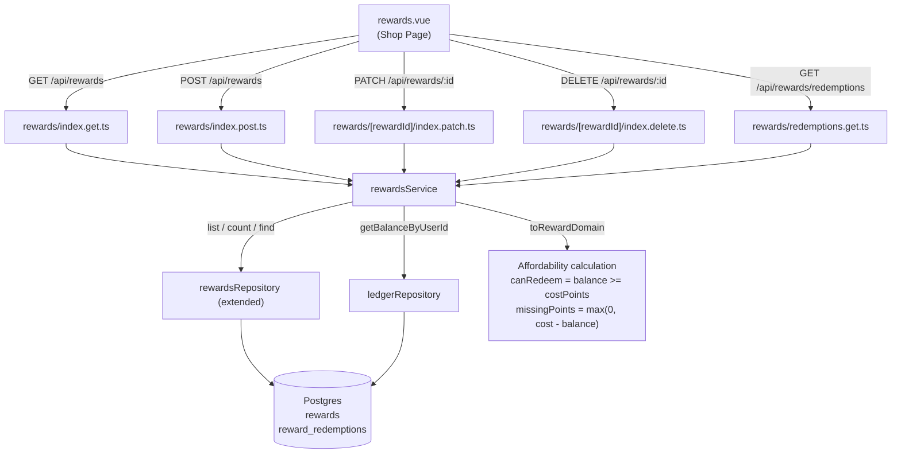

# Milestone 10 — Reward Catalog API and Reward Shop Page

## Context and Current State

Milestone 9 is complete. The points engine and ledger infrastructure are working:
`POST /api/ledger/adjustments` creates ledger rows and updates `point_balances` transactionally.
`GET /api/ledger` returns paginated transactions with a `pointsSummary`.

The browser shows the authenticated user (`andrej.edge@outlook.com`) with a live session.
The Rewards page at `/rewards` shows only the `AppPagePlaceholder` stub — no real UI.

### What already exists

| Asset | File | Notes |
|---|---|---|
| DB tables | `server/db/schema.ts` | `rewards` (with `isArchived`, `archivedAt`), `rewardRedemptions` |
| Repository (partial) | `server/repositories/rewards.ts` | Only `create`, `findById`, `listByUserId` — no pagination, no update, no archive/delete, no redemptions |
| Shared types | `shared/types/domain.ts` | `Reward`, `RewardAffordability`, `PointsSummary` — already fully typed |
| Schemas | `shared/schemas/rewards.ts` | `rewardCreateSchema`, `rewardUpdateSchema` (no `isArchived`, no query schema) |
| Page scaffold | `app/pages/rewards.vue` | Placeholder only |
| Ledger balance | `server/repositories/ledger.ts` | `getBalanceByUserId` — needed for affordability |

### What is missing

- Pagination + filtering support in the rewards repository
- Update / archive / delete operations in the repository
- Redemptions history queries (joining `reward_redemptions` with `rewards` for name)
- A `rewardsService` that calculates affordability and owns orchestration logic
- Five API routes: `GET`, `POST`, `PATCH :id`, `DELETE :id`, `GET redemptions`
- A full reward shop UI with balance display, catalog grid, create/edit form, redemption history
- Contract tests

---

## File Changes

### 1. Update `shared/schemas/rewards.ts`

**Why:** The existing `rewardUpdateSchema` derives from `rewardCreateSchema.partial()`, which inherits `.strict()` and therefore rejects `isArchived`. We also need a query schema for the list endpoint.

**Changes:**

```typescript
// Rebuild rewardUpdateSchema explicitly — no longer inherits strict from create
export const rewardUpdateSchema = z.object({
  name: z.string().trim().min(1).max(255).optional(),
  description: nullableTrimmedStringSchema.optional(),
  category: nullableTrimmedStringSchema.optional(),
  costPoints: z.coerce.number().int().positive().optional(),
  isArchived: z.boolean().optional()
}).strict().refine(
  payload => Object.keys(payload).length > 0,
  { message: 'At least one reward field must be provided', path: ['_root'] }
)

// New: query schema for GET /api/rewards
export const rewardsListQuerySchema = paginationQuerySchema.extend({
  includeArchived: z.preprocess(stringToBoolean, z.boolean().optional()).default(false)
}).strict()
```

`stringToBoolean` is the same preprocess helper already used in `common.ts` — either import it from there if it becomes exported, or inline the same logic.

**Exports to add to `shared/schemas/index.ts`:** `rewardUpdateSchema` (if not already), `rewardsListQuerySchema`.

---

### 2. Extend `server/repositories/rewards.ts`

Add the following methods to `rewardsRepository`:

#### `updateById(id: string, data: UpdateRewardData)`
```
UPDATE rewards SET ... WHERE id = :id RETURNING *
```
`UpdateRewardData` is a partial of `{ name, description, category, costPoints, isArchived, archivedAt }`.
When `isArchived` goes from `false` → `true` the caller sets `archivedAt = new Date()`.
Always sets `updatedAt = new Date()`.

#### `archiveById(id: string)`
Convenience wrapper: calls `updateById(id, { isArchived: true, archivedAt: new Date() })`.

#### `deleteById(id: string)`
Hard delete: `DELETE FROM rewards WHERE id = :id`.

#### `hasRedemptionHistory(rewardId: string): Promise<boolean>`
```sql
SELECT COUNT(*) FROM reward_redemptions WHERE reward_id = :rewardId LIMIT 1
```
Returns `true` if count > 0.

#### `listByUserIdPaginated(userId: string, includeArchived: boolean, page: number, pageSize: number)`
```sql
SELECT * FROM rewards
WHERE user_id = :userId
  AND (is_archived = false OR :includeArchived = true)
ORDER BY created_at DESC
LIMIT :pageSize OFFSET :offset
```

#### `countByUserId(userId: string, includeArchived: boolean): Promise<number>`
`COUNT(*)` variant of the above.

#### `listRedemptionsByUserId(userId: string, page: number, pageSize: number)`
Join `reward_redemptions` with `rewards` to pull `rewards.name`:
```sql
SELECT
  rr.id, rr.user_id, rr.reward_id, r.name AS reward_name,
  rr.cost_points, rr.redemption_note, rr.redeemed_at,
  rr.created_at, rr.updated_at
FROM reward_redemptions rr
INNER JOIN rewards r ON r.id = rr.reward_id
WHERE rr.user_id = :userId
ORDER BY rr.redeemed_at DESC
LIMIT :pageSize OFFSET :offset
```

#### `countRedemptionsByUserId(userId: string): Promise<number>`
`COUNT(*)` variant on `reward_redemptions WHERE user_id = :userId`.

---

### 3. Create `server/services/rewards/rewardsService.ts`

New file. Owns all rewards business logic — no DB calls in route handlers.

#### Mappers (pure, no DB I/O)

**`toRewardDomain(row, currentBalance: number): Reward`**
```typescript
{
  id: row.id,
  name: row.name,
  description: row.description,
  category: row.category,
  costPoints: row.costPoints,
  isArchived: row.isArchived,
  affordability: {
    canRedeem: !row.isArchived && currentBalance >= row.costPoints,
    missingPoints: Math.max(0, row.costPoints - currentBalance)
  },
  createdAt: row.createdAt.toISOString(),
  updatedAt: row.updatedAt.toISOString()
}
```

**`toRedemptionDomain(row): RedemptionRecord`**
```typescript
{
  id: row.id,
  rewardId: row.rewardId,
  rewardName: row.rewardName,
  costPoints: row.costPoints,
  redeemedAt: row.redeemedAt.toISOString()
}
```

#### Orchestration methods

**`listForUser(userId, options: { includeArchived, page, pageSize })`**
1. Parallel fetch: `listByUserIdPaginated`, `countByUserId`, `getBalanceByUserId`
2. Map each row with `toRewardDomain(row, balance.currentBalance ?? 0)`
3. Return `{ rewards: Reward[], meta, pointsSummary }`

**`createReward(userId, input: CreateRewardInput)`**
1. `rewardsRepository.create(...)` 
2. `ledgerRepository.getBalanceByUserId(userId)` for affordability
3. Return `toRewardDomain(row, balance)`

**`updateReward(userId, rewardId, input: UpdateRewardInput)`**
1. `rewardsRepository.findById(rewardId)` — throw 404 if not found or `userId` mismatch
2. Build `updateData`: if `isArchived === true` and current `isArchived === false`, add `archivedAt = new Date()`
3. `rewardsRepository.updateById(rewardId, updateData)`
4. Get balance, return `toRewardDomain(updated, balance)`

**`deleteOrArchiveReward(userId, rewardId)`**
1. `rewardsRepository.findById(rewardId)` — throw 404 if not found or `userId` mismatch
2. `rewardsRepository.hasRedemptionHistory(rewardId)` 
3. If history exists → `rewardsRepository.archiveById(rewardId)` (preserves audit trail)
4. If no history → `rewardsRepository.deleteById(rewardId)` (clean removal)
5. Return `void` (caller sends 204)

**`listRedemptions(userId, options: { page, pageSize })`**
1. Parallel fetch: `listRedemptionsByUserId`, `countRedemptionsByUserId`
2. Map with `toRedemptionDomain`
3. Return `{ redemptions, meta }`

---

### 4. Create API Route Files

All routes use `defineApiHandler` + `requireCurrentUser`, following the exact pattern of existing routes.

#### `server/api/rewards/index.get.ts` — `GET /api/rewards`
```typescript
const query = parseQueryWithSchema(event, rewardsListQuerySchema)
const result = await rewardsService.listForUser(user.id, query)
return success(result)
```
Response shape:
```json
{
  "data": {
    "rewards": [ /* Reward[] with affordability */ ],
    "pointsSummary": { "currentBalance": 450, "lifetimeEarned": 900, "lifetimeSpent": 450 },
    "meta": { "page": 1, "pageSize": 20, "total": 3 }
  }
}
```

#### `server/api/rewards/index.post.ts` — `POST /api/rewards`
```typescript
const body = await parseBodyWithSchema(event, rewardCreateSchema)
const reward = await rewardsService.createReward(user.id, body)
setResponseStatus(event, 201)
return success(reward)
```

#### `server/api/rewards/[rewardId]/index.patch.ts` — `PATCH /api/rewards/:rewardId`
```typescript
const rewardId = getRouterParam(event, 'rewardId')!
const body = await parseBodyWithSchema(event, rewardUpdateSchema)
const reward = await rewardsService.updateReward(user.id, rewardId, body)
return success(reward)
```

#### `server/api/rewards/[rewardId]/index.delete.ts` — `DELETE /api/rewards/:rewardId`
```typescript
const rewardId = getRouterParam(event, 'rewardId')!
await rewardsService.deleteOrArchiveReward(user.id, rewardId)
setResponseStatus(event, 204)
return null
```

#### `server/api/rewards/redemptions.get.ts` — `GET /api/rewards/redemptions`

**Important naming note:** Nuxt resolves `rewards/redemptions.get.ts` as `/api/rewards/redemptions` which could conflict with the `[rewardId]` dynamic segment if the router matches dynamic before static. Place this file at `server/api/rewards/redemptions.get.ts` (i.e., a sibling of `index.get.ts`, not inside `[rewardId]/`). Nuxt/H3 gives static segments priority over dynamic ones at the same depth, so `/api/rewards/redemptions` resolves before `/api/rewards/:rewardId`.

```typescript
const query = parseQueryWithSchema(event, paginationQuerySchema)
const result = await rewardsService.listRedemptions(user.id, query)
return success(result)
```

---

### 5. Build `app/pages/rewards.vue` — Reward Shop Page

Replace the placeholder entirely. The page has four logical sections:

#### Section A — Points Balance Header
Fetch from the `GET /api/rewards` response (which already includes `pointsSummary`).
Display: current balance (large, primary color), lifetime earned, lifetime spent.
Skeleton state while loading.

#### Section B — Reward Catalog
Grid of reward cards (2 cols on md, 3 on xl).
Each card contains:
- Reward name (bold, truncated)
- Category badge (if set)
- Description (clamped to 2 lines)
- Cost in points (`costPoints` pts)
- Affordability indicator: green "Affordable" vs amber "Need X more pts"
- **Redeem button** — `disabled` when `affordability.canRedeem === false`. In M10 the click handler is a stub (`// redemption implemented in M11`). This satisfies the acceptance criterion.
- Edit (pencil icon button) and Archive (archive icon button) actions

"Add Reward" button (primary) above the grid.

Empty state: friendly message when no active rewards with a CTA to add the first one.

#### Section C — Create / Edit Modal
A `UModal` / `UDrawer` with a form:
- Name (text input, required)
- Description (textarea, optional)
- Category (text input, optional)
- Cost (number input, required, min 1)
- Save / Cancel buttons

Used for both create (no initial data) and edit (pre-filled).
On save: POST or PATCH, then refresh rewards list.

#### Section D — Redemption History
Collapsible section at the bottom.
Fetches from `GET /api/rewards/redemptions`.
Table: Reward name, cost, redeemed at. Paginated.
Empty state message if no redemptions yet.

#### Composable / data fetching
Use `useFetch('/api/rewards', { credentials: 'include' })` for the catalog.
Use a separate `useFetch('/api/rewards/redemptions', ...)` for history.
Both refresh after any mutation.

---

### 6. Create `tests/server/milestone-10-rewards.test.ts`

Follow the exact same H3 in-process test server pattern from `tests/server/milestone-9-ledger.test.ts`.

Mount handlers:
```typescript
router.get('/api/rewards', rewardsGetHandler)
router.post('/api/rewards', rewardsPostHandler)
router.patch('/api/rewards/:rewardId', rewardsPatchHandler)
router.delete('/api/rewards/:rewardId', rewardsDeleteHandler)
router.get('/api/rewards/redemptions', redemptionsGetHandler)
```

| Test case | Expected |
|---|---|
| `GET /api/rewards` unauthenticated | `401 UNAUTHORIZED` |
| `POST /api/rewards` unauthenticated | `401 UNAUTHORIZED` |
| `GET /api/rewards` fresh user | `200`, `rewards: []`, zero `pointsSummary`, `meta.total: 0` |
| `POST /api/rewards` missing `name` | `422 VALIDATION_ERROR` |
| `POST /api/rewards` `costPoints: 0` | `422 VALIDATION_ERROR` |
| `POST /api/rewards` valid `{ name: "Coffee", costPoints: 50 }` | `201`, reward has `affordability.canRedeem: false` (balance is 0), `missingPoints: 50` |
| `GET /api/rewards` after create | `200`, 1 reward in list |
| Add balance via ledger adjustment (100 pts), then `GET /api/rewards` | reward has `affordability.canRedeem: true`, `missingPoints: 0` |
| `PATCH /api/rewards/:id` update `costPoints: 200` | `200`, updated `costPoints` reflected, `canRedeem: false` again |
| `PATCH /api/rewards/:id` wrong user | `404 NOT_FOUND` |
| `PATCH /api/rewards/:id` empty body `{}` | `422 VALIDATION_ERROR` |
| `DELETE /api/rewards/:id` (no redemption history) | `204`, subsequent GET shows 0 rewards |
| `DELETE /api/rewards/:id` wrong user | `404 NOT_FOUND` |
| `GET /api/rewards/redemptions` unauthenticated | `401 UNAUTHORIZED` |
| `GET /api/rewards/redemptions` fresh user | `200`, `redemptions: []`, `meta.total: 0` |
| `PATCH /api/rewards/:id` set `isArchived: true` | `200`, reward `isArchived: true`; `GET /api/rewards` (without `includeArchived`) shows 0 results |
| `GET /api/rewards?includeArchived=true` | shows archived reward |

All DB-hitting tests use `runIfDatabaseConfigured`.

---

## Verification Steps

After all code is written, verify in this order:

### 1. Type-check and lint
```bash
pnpm typecheck
pnpm lint
```
Fix any errors before proceeding.

### 2. Contract tests
```bash
vitest tests/server/milestone-10-rewards.test.ts
```
All tests must pass (DB-dependent tests require `DATABASE_URL` in `.env`).

### 3. Browser — API verification via devtools

Open the app at `http://localhost:3000/` (already running). Open the browser **Console** tab and run the following `fetch` calls to confirm the API behaves correctly.

**a. List rewards (expect empty)**
```javascript
fetch('/api/rewards', { credentials: 'include' }).then(r => r.json()).then(console.log)
```
Expected: `data.rewards = []`, `data.pointsSummary.currentBalance` reflects current balance, `data.meta.total = 0`.

**b. Create a reward**
```javascript
fetch('/api/rewards', {
  method: 'POST',
  credentials: 'include',
  headers: { 'content-type': 'application/json' },
  body: JSON.stringify({ name: 'Cinema Night', description: 'One movie night', costPoints: 250 })
}).then(r => r.json()).then(console.log)
```
Expected: `201`, returned reward has `affordability.canRedeem` matching current balance vs 250.

**c. List rewards (expect 1)**
Same fetch as step a — confirm 1 reward, affordability correct.

**d. Update the reward**
Copy `id` from the create response, then:
```javascript
fetch('/api/rewards/<id>', {
  method: 'PATCH',
  credentials: 'include',
  headers: { 'content-type': 'application/json' },
  body: JSON.stringify({ costPoints: 300 })
}).then(r => r.json()).then(console.log)
```
Expected: `200`, `costPoints: 300`.

**e. Validation error — empty PATCH body**
```javascript
fetch('/api/rewards/<id>', {
  method: 'PATCH',
  credentials: 'include',
  headers: { 'content-type': 'application/json' },
  body: JSON.stringify({})
}).then(r => r.json()).then(console.log)
```
Expected: `422 VALIDATION_ERROR`.

**f. Redemptions list (expect empty)**
```javascript
fetch('/api/rewards/redemptions', { credentials: 'include' }).then(r => r.json()).then(console.log)
```
Expected: `200`, `data.redemptions = []`.

**g. Archive via PATCH**
```javascript
fetch('/api/rewards/<id>', {
  method: 'PATCH',
  credentials: 'include',
  headers: { 'content-type': 'application/json' },
  body: JSON.stringify({ isArchived: true })
}).then(r => r.json()).then(console.log)
```
Expected: `200`, `isArchived: true`.

**h. Confirm archived reward is hidden by default**
Re-run step a — expect `rewards: []`. Then add `?includeArchived=true` to confirm archived reward appears.

**i. Delete via DELETE (create a fresh reward first)**
```javascript
// first create a fresh reward
fetch('/api/rewards', {
  method: 'POST',
  credentials: 'include',
  headers: { 'content-type': 'application/json' },
  body: JSON.stringify({ name: 'Delete Test', costPoints: 10 })
}).then(r => r.json()).then(d => {
  // then delete it
  return fetch(`/api/rewards/${d.data.id}`, { method: 'DELETE', credentials: 'include' })
}).then(r => console.log('status:', r.status))
```
Expected: `204`.

### 4. Browser — UI verification

Navigate to `http://localhost:3000/rewards`.

Check:
- [ ] Page no longer shows the placeholder — shows the real shop UI
- [ ] Points balance header renders with correct numbers (matches devtools responses)
- [ ] Reward catalog grid renders (any previously created rewards appear)
- [ ] "Add Reward" button opens the create modal
- [ ] Create form: fill in name + cost, save — new card appears in the grid
- [ ] Affordability badge on each card is correct (green if affordable, amber if not)
- [ ] Redeem button is **disabled** on rewards the user cannot afford
- [ ] Edit button opens the modal pre-filled; saving updates the card
- [ ] Archive button removes the card from the default view
- [ ] Redemption history section renders (empty state for fresh user)
- [ ] No console errors

### 5. Mark complete
Change `[ ]` → `[x]` for Milestone 10 in `docs/Implementation-Plan.md`.

---

## Architecture Diagram



---

## Key Design Decisions

| Decision | Rationale |
|---|---|
| Archive-not-delete when history exists | Preserves the redemption audit trail; `isArchived` flag keeps the reward visible in history but hidden from the active catalog |
| Affordability computed at list time (not stored) | Balance changes constantly; computing on read ensures the value is always fresh without event-sourcing complexity |
| `rewardsService` owns affordability logic | Keeps route handlers thin and makes the calculation unit-testable in isolation |
| `GET /api/rewards` includes `pointsSummary` | Saves the UI from a second round-trip to show the balance header alongside the catalog |
| Redeem button stubbed in M10 | M10 acceptance requires the button to exist and be disabled when unaffordable; actual POST to redeem is M11's scope |
| Static `/redemptions` route at same depth as `[rewardId]` | H3/Nuxt resolves static segments before dynamic at the same depth — confirmed safe pattern already used in this codebase |
