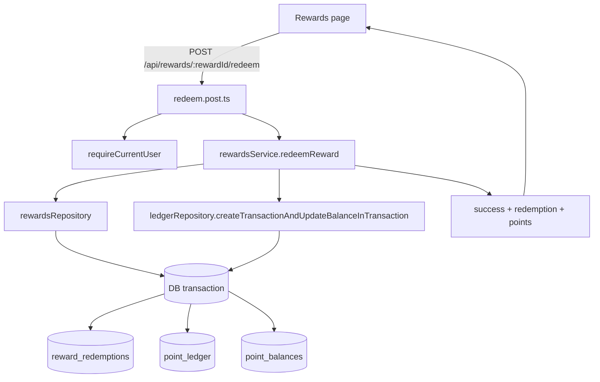

# Milestone 11 — Reward Redemption

## Context and Current State

Milestone 10 completed the reward catalog and reward history surfaces, but not the spend-points action itself.

What already exists:

| Asset | File | Notes |
|---|---|---|
| Rewards page | `app/pages/rewards.vue` | Renders balance, catalog, create/edit modal, and redemption history; redeem button still calls `stubRedeem()` |
| Rewards service | `server/services/rewards/rewardsService.ts` | Handles listing, create, update, delete/archive, and redemption history |
| Rewards repository | `server/repositories/rewards.ts` | Can list rewards and redemption history; cannot insert or look up a redemption write result yet |
| Ledger repository | `server/repositories/ledger.ts` | Already supports `createTransactionAndUpdateBalanceInTransaction(...)`, which must be reused for the spend path |
| Schema | `server/db/schema.ts` | `rewards`, `reward_redemptions`, `point_ledger`, and `point_balances` all exist |
| API contract | `docs/API-endpoint-specification.md` | Defines `POST /api/rewards/{rewardId}/redeem`, success shape, and `409 INSUFFICIENT_POINTS` |

What is still missing:

- A write path for `reward_redemptions`
- A transactional orchestration method for reward redemption
- The redeem API route
- Duplicate-submit protection strong enough to survive retries and double clicks
- Rewards page wiring for the live redeem action
- Focused contract tests for the new endpoint

## API Contract

From `docs/API-endpoint-specification.md` section 10.5:

**Endpoint**

```http
POST /api/rewards/{rewardId}/redeem
```

**Success response**

```json
{
  "data": {
    "success": true,
    "redemption": {
      "id": "red_123",
      "rewardId": "rew_123",
      "rewardName": "Cinema Night",
      "costPoints": 250,
      "redeemedAt": "2026-04-12T18:00:00Z"
    },
    "points": {
      "currentBalance": 610,
      "lifetimeEarned": 1420,
      "lifetimeSpent": 810
    }
  }
}
```

**Insufficient balance response**

```json
{
  "error": {
    "code": "INSUFFICIENT_POINTS",
    "message": "Not enough points to redeem this reward",
    "details": {
      "rewardId": "rew_123",
      "missingPoints": 40
    }
  }
}
```

## Recommended Implementation Decisions

### 1. Treat idempotency as durable server-side state

The rewards page currently prevents nothing more than a disabled button. That is not enough for network retries, duplicate browser submissions, or a future dashboard action. The safest slice is:

- Read an optional `Idempotency-Key` request header in the route.
- Persist that key on the redemption record, not only on the ledger row.
- Enforce uniqueness per user so the original redemption can be returned on a retry.
- Reuse the same idempotency key for the ledger row to keep cross-table tracing aligned.

### 2. Keep the transaction boundary in one service method

The architecture doc already states that reward redemption must be atomic:

- validate reward
- verify balance
- insert redemption row
- create `spent` ledger transaction
- decrement balance

That orchestration belongs in `rewardsService.redeemReward(...)`, not in the route and not spread across UI calls.

### 3. Keep the UI optimistic only about loading state, not balances

The rewards page should not compute a new balance client-side after success. It should refresh from server truth after redemption, because the server remains authoritative for:

- balance arithmetic
- affordability
- idempotent retry resolution
- archived reward eligibility

## Files to Create or Modify

### 1. `server/db/schema.ts` and a new Drizzle migration

Add durable idempotency support to `reward_redemptions`.

Recommended schema change:

- add `idempotencyKey: varchar('idempotency_key', { length: 255 })`
- add a partial unique index on `(userId, idempotencyKey)` where the key is not null

Why this is preferred:

- deduplicates the user action at the business-event layer
- lets the service re-read and return the original redemption on retries
- avoids producing a redemption row without a matching ledger row or vice versa

Migration expectations:

- create a new SQL migration under `drizzle/`
- update the matching Drizzle metadata snapshot if the repo workflow expects it
- keep the migration narrowly scoped to the new column and index only

### 2. `shared/types/domain.ts` or `shared/types/api.ts`

Add a stable response type for the redeem action if it simplifies route and UI usage.

Suggested shape:

```ts
interface RewardRedemptionResult {
  success: true
  redemption: RedemptionRecord
  points: PointsSummary
}
```

If the existing codebase already prefers inline return types for small route handlers, keep this optional. Do not add extra schema surface just for an empty request body.

### 3. `server/repositories/rewards.ts`

Extend `rewardsRepository` with write and lookup helpers.

Add interfaces:

- `CreateRewardRedemptionInput`
- `RewardRedemptionRow` or equivalent if the current joined list row type is not appropriate for single-record reads

Add methods:

**`createRedemption(tx, input)`**

- accepts a transaction-scoped DB client
- inserts into `reward_redemptions`
- stores `userId`, `rewardId`, `costPoints`, optional `redemptionNote` (currently null unless you add notes later), and `idempotencyKey`
- returns the inserted row

**`findRedemptionById(id)`**

- reads one redemption joined with `rewards.name`
- used for response mapping and idempotent retry recovery

**`findRedemptionByUserIdAndIdempotencyKey(userId, idempotencyKey)`**

- returns the existing redemption row when a duplicate request is retried
- if no key is supplied, returns null

Implementation note:

- Keep single-record reads aligned with the existing `toRedemptionDomain(...)` mapper in `rewardsService.ts` so response formatting remains centralized.

### 4. `server/services/rewards/rewardsService.ts`

Add a new orchestration method:

```ts
redeemReward(userId: string, rewardId: string, options?: { idempotencyKey?: string | null })
```

Recommended flow:

1. If `options.idempotencyKey` is present, check for an existing redemption for `(userId, idempotencyKey)` before starting the transaction.
2. Load the reward by `rewardId`.
3. Reject with `404` if the reward does not exist or belongs to another user.
4. Reject with `404` or `409` for archived rewards based on the repo's existing error style. Prefer `404` if you want archived rewards to behave like unavailable resources; prefer `409` if you want to signal a valid but unusable current state. Pick one and keep it consistent in tests.
5. Start one DB transaction.
6. Inside the transaction, load the latest `point_balances` row for the user.
7. If the current balance is below `reward.costPoints`, throw a conflict error with:

```json
{
  "code": "INSUFFICIENT_POINTS",
  "details": {
    "rewardId": "...",
    "missingPoints": reward.costPoints - currentBalance
  }
}
```

8. Insert the redemption row.
9. Call `ledgerRepository.createTransactionAndUpdateBalanceInTransaction(...)` with:

- `transactionType: 'spent'`
- `amount: reward.costPoints`
- a redemption-specific description such as `Redeemed reward: ${reward.name}`
- `source: 'reward_redemption'`
- `relatedEntityType: 'reward_redemption'`
- `relatedEntityId: redemption.id`
- `idempotencyKey: options.idempotencyKey ?? null`
- metadata containing at least `rewardId` and `rewardName`

10. Map the inserted redemption through `toRedemptionDomain(...)`.
11. Convert the updated balance row to points summary with `pointsEngineService.balanceRowToSummary(...)`.
12. Return `{ success: true, redemption, points }`.

Important behavior:

- If the idempotency key already exists, return the original redemption + current points summary instead of creating new writes.
- Failure before the ledger write must roll back the redemption insert.
- Failure during the ledger write must roll back the redemption insert.

### 5. `server/api/rewards/[rewardId]/redeem.post.ts`

Create the new route.

Expected structure:

```ts
requireCurrentUser(event)
getRouterParam(event, 'rewardId')
read optional Idempotency-Key header
call rewardsService.redeemReward(user.id, rewardId, { idempotencyKey })
return success(result)
```

Route rules:

- no request body parsing is required for MVP
- unauthenticated requests return `401`
- insufficient balance returns `409`
- leave response formatting to `success(...)` and the shared API error helpers

### 6. `app/pages/rewards.vue`

Replace the stub action with a real redeem flow.

#### State additions

- `redeemingId = ref<string | null>(null)`
- `redeemError = ref('')`

#### `redeemReward(reward: Reward)` behavior

1. Clear previous redeem error.
2. Set `redeemingId` to the clicked reward id.
3. POST to `/api/rewards/${reward.id}/redeem` with `credentials: 'include'`.
4. Optionally send a generated idempotency key header from the client. If you do, use `crypto.randomUUID()` once per click and do not regenerate it during a retry for the same request path.
5. On success, call `refreshList()` and `refreshRedemptions()`.
6. On failure, surface the API message. For `INSUFFICIENT_POINTS`, show the server message directly.
7. Clear `redeemingId` in `finally`.

#### Button behavior

- disable when `!reward.affordability?.canRedeem`
- also disable when `redeemingId === reward.id`
- optionally show a loading label or spinner for the active reward only

#### UX expectations

- successful redemption should visibly update current balance and lifetime spent
- the reward card affordability badge should update after refresh
- the redemption history section should gain a new row immediately after refresh

### 7. `tests/server/milestone-11-redemption.test.ts`

Create a focused test file rather than extending Milestone 10.

Use the same in-process H3 server pattern already used by the other milestone tests:

- add `sessionMiddleware`
- mount `POST /api/internal/test-auth/session`
- mount the new redeem route
- mount the existing rewards and ledger routes if needed for setup or assertions

Test matrix:

| Test case | Expected |
|---|---|
| `POST /api/rewards/:rewardId/redeem` unauthenticated | `401` |
| reward not found | `404` |
| reward belongs to different user | `404` |
| archived reward | chosen contract from implementation decision, asserted consistently |
| user has insufficient points | `409`, `INSUFFICIENT_POINTS`, correct `missingPoints` |
| successful redemption | `200`, `success: true`, redemption payload, updated points summary |
| successful redemption persists history | `GET /api/rewards/redemptions` includes the new row |
| successful redemption writes ledger row | `GET /api/ledger` shows one `spent` transaction |
| duplicate request with same `Idempotency-Key` | still only one redemption row and one spent ledger row |
| failed redemption | no redemption row, no spent ledger row, no balance change |

Setup helpers to include:

- create a user and session cookie
- create a reward for that user
- grant points via `POST /api/ledger/adjustments` or direct repo setup

Assertions that matter most:

- `currentBalance` decreases by exactly `costPoints`
- `lifetimeSpent` increases by exactly `costPoints`
- `lifetimeEarned` does not change during redemption

## Implementation Order

1. Confirm the archived-reward error policy and idempotency approach.
2. Add schema + migration support for redemption idempotency.
3. Extend the rewards repository with redemption writes and lookup helpers.
4. Implement `rewardsService.redeemReward(...)` and keep all transaction logic there.
5. Add the route handler.
6. Add the server test file and get it passing before touching UI.
7. Wire the rewards page redeem flow.
8. Run full verification.
9. Mark Milestone 11 complete in `docs/Implementation-Plan.md`.

## Verification Steps

### Automated

Run all of the following from the repo root:

1. `pnpm lint`
2. `pnpm typecheck`
3. `pnpm db:smoke`
4. `pnpm vitest run tests/server/milestone-10-rewards.test.ts tests/server/milestone-11-redemption.test.ts`

Optional broader regression if time is low-risk:

5. `pnpm vitest run tests/server/milestone-9-ledger.test.ts`

### Manual

1. Start the app with `pnpm dev`.
2. Open `/rewards` as an authenticated user.
3. Create a reward if none exists.
4. Grant points using the existing manual adjustment flow.
5. Redeem one affordable reward.
6. Confirm the page refreshes to show:
   - lower `Current balance`
   - higher `Lifetime spent`
   - updated affordability badges
   - one new redemption history row
7. Attempt to redeem a reward that costs more than the current balance.
8. Confirm the UI shows the API error and the page data remains unchanged.
9. Repeat the same redeem request with the same `Idempotency-Key` or trigger a fast duplicate submission.
10. Confirm only one redemption history row and one `spent` ledger row exist.

## Acceptance Criteria

- Affordable rewards redeem cleanly.
- The API returns the updated points summary after success.
- Insufficient balance returns `409 INSUFFICIENT_POINTS` with `missingPoints`.
- Duplicate clicks or retried requests do not create duplicate spends.
- The rewards page reflects the updated balance and redemption history after redemption.

## Diagram

