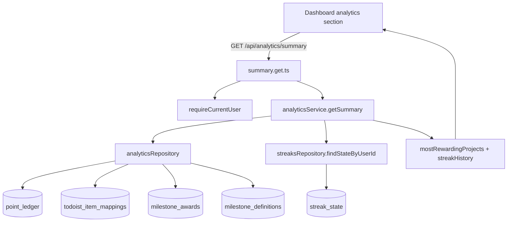

# Milestone 16 — Analytics Summary

## Context and Current State

Milestones 12 through 14 established the dashboard, webhook-earned points, and streak engine, but the app still has no dedicated analytics endpoint or UI slice for the MVP analytics summary.

What already exists:

| Asset | File | Notes |
|---|---|---|
| Analytics API contract | `docs/API-endpoint-specification.md` | Documents `GET /api/analytics/summary` with `mostRewardingProjects` and `streakHistory` |
| MVP analytics requirements | `docs/PRD.md`, `docs/Description.md` | Limits scope to most rewarding projects plus current streak, longest streak, and milestones reached |
| Analytics route folder | `server/api/analytics/` | Exists but is still empty |
| Dashboard page | `app/pages/index.vue` | Already renders points, streak, tasks, rewards, and notifications and is the best place for a lightweight analytics section |
| Dashboard aggregation pattern | `server/services/dashboard/dashboardService.ts` | Demonstrates the current read-model style for a page-focused aggregate service |
| Ledger persistence | `server/repositories/ledger.ts` | Stores all points activity and already exposes balance and ledger reads |
| Todoist item mappings | `server/repositories/item-mappings.ts` | Stores task, subtask, and project linkage including `projectTodoistId` needed to attribute earned points back to projects |
| Webhook-earned points flow | `server/services/todoist/webhookService.ts` | Writes task and subtask completion points with stable `source`, `relatedEntityType`, and `relatedEntityId` values that analytics can aggregate |
| Streak state and milestone awards | `server/repositories/streaks.ts`, `server/db/schema.ts` | Already persist `currentStreak`, `longestStreak`, and deduplicated milestone awards |

What is still missing:

- Shared analytics response types
- A repository dedicated to analytics reads
- An analytics service
- `GET /api/analytics/summary`
- A dashboard analytics section or dedicated summary area
- Focused server contract tests for the new endpoint

## Scope Decisions

### 1. Do not add schema or migration work

Milestone 16 should be implemented entirely from existing tables and relationships:

- `point_ledger`
- `point_balances`
- `todoist_item_mappings`
- `streak_state`
- `milestone_awards`
- `milestone_definitions`

If the implementation appears to require a new analytics projection table, that is scope creep beyond the MVP requirement. This milestone is a read-model slice only.

### 2. Keep analytics read-only and separate from the dashboard contract

The milestone explicitly requires `GET /api/analytics/summary`. Keep that endpoint independent instead of folding analytics into `GET /api/dashboard`.

That gives two useful properties:

- analytics can be added to the dashboard UI without widening the existing dashboard response contract
- analytics can fail or lag independently without taking down the home-page core loop

### 3. Prefer a lightweight dashboard section over a new dedicated page

The implementation plan allows either a dashboard section or a dedicated summary area. The smallest complete slice is to add one lightweight analytics section to `app/pages/index.vue`.

Reasons:

- the dashboard is already the app’s summary surface
- the endpoint is small enough that a separate page would mostly add routing and navigation overhead
- keeping analytics on the dashboard avoids opening Milestone 17-style page-level UI work early

If the dashboard becomes too crowded during implementation, the fallback is a compact linked card with a dedicated section lower on the same page, not a brand-new route.

### 4. Define “most rewarding projects” narrowly as project-attributable work points

The PRD says analytics should show which projects generated the most points. That means project totals should count only points that can be attributed back to Todoist work items.

Recommended inclusion rules:

- include earned points from subtask completion rows written by `todoist_webhookService`
- include task completion bonus rows when they are tied to a task in a project
- exclude reward redemptions, manual adjustments, streak milestone bonuses, and any other rows not attributable to a Todoist project

Recommended attribution path:

1. read eligible rows from `point_ledger`
2. join `point_ledger.relatedEntityId` to `todoist_item_mappings.todoistItemId`
3. read the task or subtask row’s `projectTodoistId`
4. join that project Todoist id back to the project mapping row for the project title

This keeps analytics aligned with the existing write model and avoids storing duplicate project names in ledger metadata.

### 5. Use milestone awards as the source of truth for milestones reached

The milestone count should come from `milestone_awards`, not from inferring reached days from streak history or current streak.

Reasons:

- milestone awards are already deduplicated and durable
- the award table reflects actual milestone completion, not just current streak state
- later streak resets should not erase a historically reached milestone

Return the reached milestones as a sorted array of day counts.

## Backend Plan

### 1. Extend shared analytics types

Update `shared/types/domain.ts` with a small analytics contract used by both the route and the dashboard UI.

Recommended additions:

- `AnalyticsProjectSummary`
- `AnalyticsStreakHistorySummary`
- `AnalyticsSummary`

Suggested shape:

```ts
export interface AnalyticsProjectSummary {
  projectId: string
  projectName: string
  pointsEarned: number
}

export interface AnalyticsStreakHistorySummary {
  current: number
  longest: number
  milestonesReached: number[]
}

export interface AnalyticsSummary {
  mostRewardingProjects: AnalyticsProjectSummary[]
  streakHistory: AnalyticsStreakHistorySummary
}
```

Keep this contract small. Do not add trends, charts, date ranges, or per-day history; those belong to a later analytics expansion, not the MVP.

### 2. Add a dedicated analytics repository

Create `server/repositories/analytics.ts` rather than overloading `ledgerRepository` or `dashboardRepository`.

Recommended methods:

#### `listMostRewardingProjectsByUserId(userId: string, limit = 5)`

Responsibilities:

- read only eligible project-attributable ledger rows for the user
- join through `todoist_item_mappings` to resolve the owning project
- aggregate `SUM(amount)` by project
- sort by total points descending, then by project name ascending for stable output
- cap the result set to a small limit suitable for MVP UI display

Recommended eligibility rules:

- include `transactionType = 'earned'` rows from Todoist completion sources
- include `transactionType = 'bonus'` rows only when they represent task completion bonuses, not streak bonuses
- exclude `spent`, `adjusted`, and unrelated `bonus` sources

Implementation note:

- because webhook rows already use stable `source` values like `todoist_webhook_subtask_completion` and `todoist_webhook_task_completion_bonus`, prefer filtering on source plus positive transaction intent instead of trying to infer eligibility from free-form descriptions

Recommended fallback behavior:

- if the project title mapping is missing, still return the project using the Todoist project id as `projectId` and a fallback `projectName` such as `Unknown project`
- do not drop attributable points entirely just because a project row is stale or missing

#### `listReachedMilestonesByUserId(userId: string)`

Responsibilities:

- join `milestone_awards` to `milestone_definitions`
- return the awarded milestone day values in ascending order
- keep the read user-scoped and history-preserving even if milestone definitions later change state

If the implementation finds that `milestone_awards.awardedForDays` already contains the exact values needed without a join, it is acceptable to read directly from the award table, but document that choice in code comments only if necessary.

### 3. Add an analytics service

Create `server/services/analytics/analyticsService.ts`.

Recommended public surface:

```ts
analyticsService.getSummary(userId: string): Promise<AnalyticsSummary>
```

Implementation outline:

1. `await settingsRepository.ensureDefaults(userId)` so streak-state defaults exist even for new users.
2. In parallel, load:
   - `analyticsRepository.listMostRewardingProjectsByUserId(userId, 5)`
   - `streaksRepository.findStateByUserId(userId)`
   - `analyticsRepository.listReachedMilestonesByUserId(userId)`
3. Map the streak state to:
   - `current = state?.currentStreak ?? 0`
   - `longest = state?.longestStreak ?? 0`
4. Sort and normalize `milestonesReached` ascending with duplicates removed defensively.
5. Return the final `AnalyticsSummary` DTO.

Important behavior:

- empty analytics must return a successful response with empty arrays and zero values, not `404`
- do not read or calculate balances here; this endpoint is about project totals and streak history only
- do not trigger `streakService.ensureEvaluatedThroughDate(...)` from analytics unless implementation proves stale streak state is a real problem for the route; if needed, do it explicitly and mention it in tests because that adds read-side side effects

Recommended initial bias:

- keep the analytics service pure and read-only first
- only add streak catch-up if a concrete discrepancy appears between dashboard and analytics summaries

### 4. Add the analytics route

Create `server/api/analytics/summary.get.ts`.

Expected structure:

```ts
export default defineApiHandler(async (event) => {
  const user = await requireCurrentUser(event)
  const summary = await analyticsService.getSummary(user.id)
  return success(summary)
})
```

Route rules:

- unauthenticated requests return `401`
- no query params are required for MVP
- keep response formatting inside the shared `success(...)` helper

## UI Plan

### 1. Add a lightweight analytics section to the dashboard

Update `app/pages/index.vue` to fetch the analytics summary independently from the existing dashboard data.

Recommended approach:

- keep the existing `useFetch('/api/dashboard')` unchanged
- add a second `useFetch('/api/analytics/summary')`
- render analytics as a self-contained section lower on the dashboard page

Why this split is useful:

- analytics loading and failure states stay isolated
- the milestone does not require widening `DashboardSummary`
- the page can progressively render the dashboard even if analytics lags

### 2. Keep the UI small and motivation-oriented

The analytics section should show only:

- top rewarding projects
- current streak
- longest streak
- milestone badges or a compact reached-milestones list

Recommended layout:

- one card for `Most rewarding projects`
- one adjacent card for `Streak history`

Recommended UX details:

- show a compact empty state like `No completed project activity yet` when no project totals exist
- render milestone values as subtle badges such as `7 days`, `14 days`
- keep copy concise and dashboard-consistent; avoid charts, timelines, or filters in this milestone

### 3. Let analytics fail softly

Because analytics is supplementary to the home-page core loop, the page should not block the whole dashboard on an analytics fetch failure.

Recommended behavior:

- if `/api/analytics/summary` fails, show a local card-level error message and keep the rest of the dashboard interactive
- do not reuse the main dashboard error banner for analytics-only failures
- allow manual refresh through the page’s existing refresh path or a small retry action if the current design already supports it cleanly

## Files to Create or Modify

### 1. `shared/types/domain.ts`

Add the analytics summary types and export them through the existing shared type barrel if needed.

### 2. `server/repositories/analytics.ts`

Create the analytics repository with project aggregation and milestone-history reads.

### 3. `server/services/analytics/analyticsService.ts`

Create the analytics domain service.

### 4. `server/api/analytics/summary.get.ts`

Create the new authenticated route.

### 5. `app/pages/index.vue`

Add the lightweight analytics section and isolated fetch state handling.

### 6. `tests/server/milestone-16-analytics.test.ts`

Create a focused contract test file for the new endpoint rather than extending another milestone test.

## Test Plan

Create `tests/server/milestone-16-analytics.test.ts` using the same in-process H3 pattern already used by Milestones 10 through 14.

Mount at minimum:

- `sessionMiddleware`
- `POST /api/internal/test-auth/session`
- `GET /api/analytics/summary`

Seed data directly with repositories or DB inserts where that is cheaper than routing through unrelated APIs.

Recommended test matrix:

| Test case | Expected |
|---|---|
| unauthenticated `GET /api/analytics/summary` | `401` |
| authenticated user with no ledger or streak history | `200`, empty `mostRewardingProjects`, `current = 0`, `longest = 0`, empty `milestonesReached` |
| project aggregation across multiple earned rows in one project | sums points into one project total |
| task bonus rows tied to a project | included in that project’s total |
| spent, adjusted, and streak milestone bonus rows | excluded from project totals |
| multiple projects with different totals | ordered descending by `pointsEarned` |
| tie on points | stable secondary ordering, preferably by project name |
| user scoping | only the authenticated user’s ledger, mappings, and awards appear |
| milestone awards present | `milestonesReached` returns sorted milestone day values |
| streak state present | `current` and `longest` reflect `streak_state` |
| missing project row but attributable task mapping exists | endpoint still succeeds with a fallback project name |

Assertions that matter most:

- project totals reflect only project-attributable work points
- current and longest streak come from persisted streak state
- milestones reached come from durable milestone awards, not inferred current streak
- unrelated rows from another user never leak into the response

## Verification Steps

### Automated

Run all of the following from the repo root:

1. `pnpm lint`
2. `pnpm typecheck`
3. `pnpm db:smoke`
4. `pnpm vitest run tests/server/milestone-16-analytics.test.ts`
5. `pnpm vitest run tests/server/milestone-12-dashboard.test.ts tests/server/milestone-13-webhook.test.ts tests/server/milestone-14-streaks.test.ts`

Why these regressions matter:

- Milestone 12 validates the dashboard still renders and contracts still hold
- Milestone 13 validates the ledger row shape analytics depends on
- Milestone 14 validates streak and milestone-award reads used by analytics

### Manual

1. Start the app with `pnpm dev`.
2. Sign in as a development user with synced Todoist data.
3. Ensure at least two Todoist projects exist in local mappings.
4. Generate earned points in more than one project using the existing webhook or test setup path.
5. Award at least one streak milestone if practical, or seed one in the dev database.
6. Open `/` and confirm the new analytics section renders without affecting the rest of the dashboard.
7. Verify the project with the higher earned total appears first.
8. Verify reward redemptions, manual adjustments, and streak bonuses do not inflate project totals.
9. Verify the streak card shows current streak, longest streak, and reached milestone badges or labels.
10. Temporarily induce an analytics fetch failure if convenient and confirm the dashboard still loads while the analytics section shows a local error state.

## Acceptance Criteria

- `GET /api/analytics/summary` returns the documented MVP analytics shape.
- Most rewarding projects are aggregated correctly from project-attributable earned points.
- Streak history returns current streak, longest streak, and reached milestones.
- Analytics remains MVP-scoped and does not add heavyweight charts, filters, or date-range controls.
- The dashboard shows a lightweight analytics section without regressing existing dashboard functionality.

## Diagram

