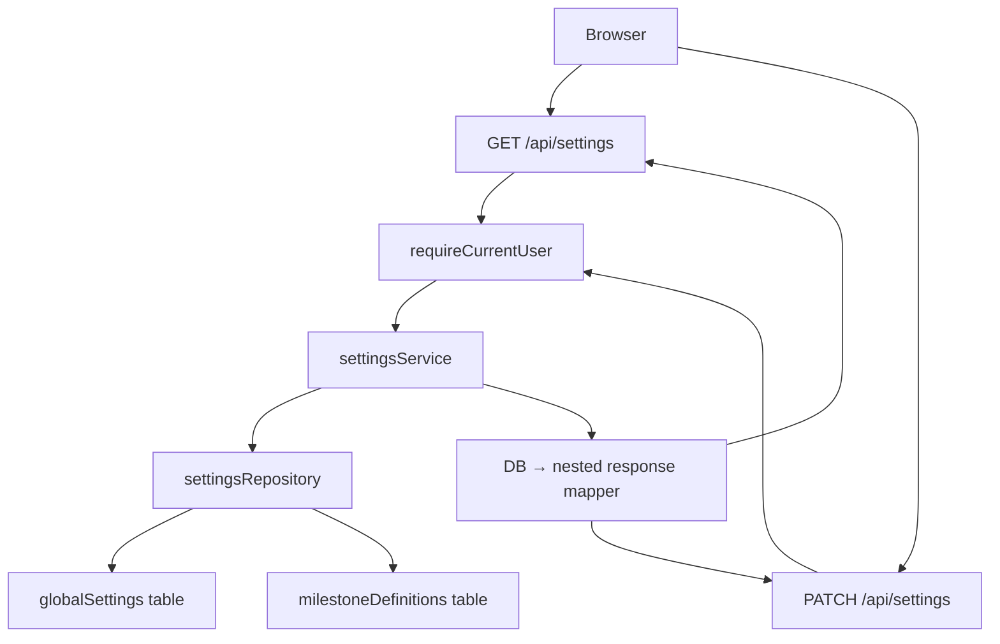

# Milestone 8 — Settings API and Settings Page

## Context

The `globalSettings` table (primary key `userId`) and `milestoneDefinitions` table already exist in [`server/db/schema.ts`](server/db/schema.ts). The `settingsRepository` in [`server/repositories/settings.ts`](server/repositories/settings.ts) already provides `findByUserId`, `findMilestonesByUserId`, and `ensureDefaults`. No settings API routes or service exist yet. The settings page [`app/pages/settings.vue`](app/pages/settings.vue) is a placeholder component.

The `settingsUpdateSchema` in [`shared/schemas/settings.ts`](shared/schemas/settings.ts) is flat and unused beyond its barrel export — it can be replaced.

## API Contract (from [`docs/API-endpoint-specification.md`](docs/API-endpoint-specification.md) §11)

**GET /api/settings** — response shape:
```
{ data: { points: { difficultyMultiplierBase, priorityMultipliers: {low, medium, high}, defaultCompletionBonusEnabled, defaultCompletionBonusPercent }, streak: { ruleType, ruleValue, protectionEnabled, startingProtectionBalance, protectionRewardEveryNDays, protectionRewardAmount, bonusStrategy, milestonePercentageWindowDays, milestones: [...] } } }
```

**PATCH /api/settings** — accepts same nested shape (all fields optional), returns `{ data: { success: true, settings: { ...same shape... } } }`. Invalid payload → `422`.

**Key mapping notes:**
- `defaultCompletionBonusEnabled` is not a DB column — derive it as `completionBonusPercent > 0` in GET; in PATCH, if `enabled = false`, set `completionBonusPercent = 0`.
- `streak.milestones` maps to the `milestoneDefinitions` table; updating milestones replaces all rows for the user atomically in a transaction.
- `streak.bonusStrategy` maps to `milestoneBonusStrategy` column.

## Files to Create / Modify

### 1. `shared/schemas/settings.ts`
Replace the flat `settingsUpdateSchema` with a nested `settingsPatchBodySchema` matching the API spec:
- `points` section (all optional): `difficultyMultiplierBase`, `priorityMultipliers.{low,medium,high}`, `defaultCompletionBonusEnabled`, `defaultCompletionBonusPercent`
- `streak` section (all optional): `ruleType`, `ruleValue`, `protectionEnabled`, `startingProtectionBalance`, `protectionRewardEveryNDays`, `protectionRewardAmount`, `bonusStrategy`, `milestonePercentageWindowDays`, `milestones` (array of `{days, fixedBonusPoints, percentageBonus, isActive}`)
- Root `.refine()` ensuring at least one section is present

### 2. `shared/types/domain.ts`
Add `GlobalSettingsResponse` interface (nested shape matching the GET response above).

### 3. `server/repositories/settings.ts`
Add two new methods to `settingsRepository`:
- `updateGlobalSettings(userId, updates)` — `db.update(globalSettings).set(updates).where(eq(globalSettings.userId, userId))`
- `replaceMilestones(userId, milestones)` — `db.transaction()`: delete all rows in `milestoneDefinitions` where `userId`, then bulk-insert the new rows

### 4. `server/services/settings/settingsService.ts` (new)
Two functions:
- `getSettings(userId)` — calls `settingsRepository.ensureDefaults(userId)`, fetches settings + milestones, maps flat DB row to nested `GlobalSettingsResponse`
- `updateSettings(userId, body)` — maps nested payload to flat DB fields, calls `settingsRepository.updateGlobalSettings()`, conditionally calls `settingsRepository.replaceMilestones()`, returns `getSettings(userId)`

### 5. `server/api/settings/index.get.ts` (new)
```
requireCurrentUser → settingsService.getSettings(user.id) → success(settings)
```

### 6. `server/api/settings/index.patch.ts` (new)
```
requireCurrentUser → parseBodyWithSchema(settingsPatchBodySchema) → settingsService.updateSettings(user.id, body) → success({ success: true, settings })
```
Zod parse failure is caught by `defineApiHandler` and returned as `422`.

### 7. `app/pages/settings.vue`
Replace placeholder with a real settings form using `UCard`, `UForm`, and Nuxt's `$fetch`:
- On mount: `useFetch('/api/settings')` to populate form state
- Two sections: **Points** (difficulty multiplier, priority multipliers, completion bonus) and **Streak** (rule type/value, protection, milestone strategy, milestones list)
- Save button calls `$fetch('/api/settings', { method: 'PATCH', body })` and shows inline success/error feedback
- Empty/loading states handled explicitly

### 8. `tests/server/milestone-8-settings.test.ts` (new)
Follow the pattern from [`tests/server/milestone-7-tasks.test.ts`](tests/server/milestone-7-tasks.test.ts):
- Spin up an in-process h3 app with `sessionMiddleware` + `test-auth` + settings handlers
- Use `runIfDatabaseConfigured` guard

Tests to cover:
- `GET /api/settings` returns correct nested shape with default values
- `GET /api/settings` returns 401 when unauthenticated
- `PATCH /api/settings` with valid `points` payload persists and returns updated values
- `PATCH /api/settings` with valid `streak` payload (including milestones replacement) persists and returns
- `PATCH /api/settings` with empty body returns `422`
- `PATCH /api/settings` with invalid value (e.g. `difficultyMultiplierBase: 0`) returns `422`
- `PATCH /api/settings` returns 401 when unauthenticated

## Data Flow



## Verification Steps

1. **Type check and lint**: `pnpm typecheck && pnpm lint` — must pass with no errors
2. **Run the new test suite**: `vitest tests/server/milestone-8-settings.test.ts` — all tests green (requires `DATABASE_URL` set)
3. **Regression**: `pnpm db:smoke` and `vitest tests/server/milestone-7-tasks.test.ts` — still green
4. **Browser — GET**: logged-in user visits `/api/settings` directly or via the settings page; response has nested `points` and `streak` keys with correct defaults
5. **Browser — PATCH valid**: save a modified `difficultyMultiplierBase`; refresh and confirm the value persists
6. **Browser — PATCH invalid**: send `{ "points": { "difficultyMultiplierBase": -1 } }` directly via fetch/curl; expect `422 VALIDATION_ERROR`
7. **Browser — PATCH empty body**: send `{}` to `PATCH /api/settings`; expect `422` with message about missing section
8. **Browser — unauthenticated**: call either endpoint without a session cookie; expect `401`
9. **Settings page UI**: navigate to `/settings`; form loads, edit a value, save, reload — value is persisted
