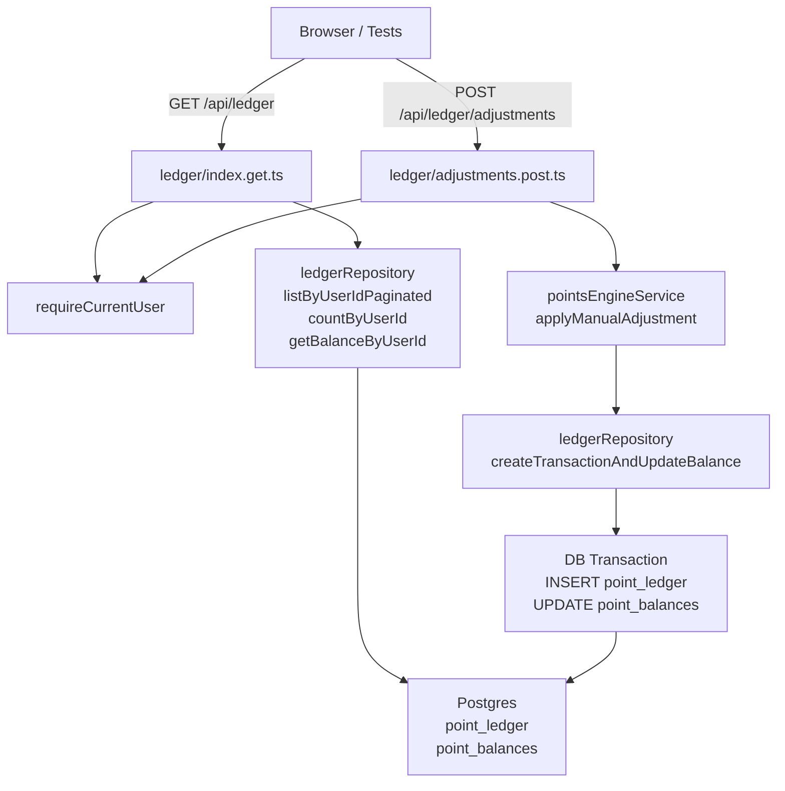

# Milestone 9 — Points Engine & Ledger Foundation

## Context and Current State

The browser confirms Milestones 6–8 are working (settings page is live, sync runs post-OAuth). The `docs/Implementation-Plan.md` has a bug: Milestone 9 appears in the **Verified Baseline** as complete, but is still `[ ]` in the checklist — it is NOT done.

What already exists as foundation:
- DB tables: `point_ledger`, `point_balances` (schema fully defined with constraints)
- [`server/repositories/ledger.ts`](server/repositories/ledger.ts) — `createTransaction` (inserts ledger row, **does not** update balance) and `listByUserId` (no pagination)
- [`shared/schemas/ledger.ts`](shared/schemas/ledger.ts) — `manualLedgerAdjustmentSchema` already defined
- [`shared/types/domain.ts`](shared/types/domain.ts) — `LedgerTransaction` and `PointsSummary` types already defined
- [`server/services/tasks/pointsCalculator.ts`](server/services/tasks/pointsCalculator.ts) — `calculateEstimatedPoints` (display-only estimation)
- [`server/repositories/settings.ts`](server/repositories/settings.ts) — `findPointBalanceByUserId` (read-only)

What is **missing**:
- Atomic ledger insert + balance update (the current `createTransaction` does not touch `point_balances`)
- Points engine service (calculates subtask points and completion bonus; calls the atomic write)
- `GET /api/ledger` handler
- `POST /api/ledger/adjustments` handler
- Contract tests (`tests/server/milestone-9-ledger.test.ts`)

## File Changes

### 1. Fix `docs/Implementation-Plan.md`
- Remove Milestone 9 from the **Verified Baseline** section (it is not done)
- Add a note that Milestones 6, 7, 8 are now also complete (they are already `[x]` in the checklist)

### 2. Extend [`server/repositories/ledger.ts`](server/repositories/ledger.ts)

Add three new methods:

**`createTransactionAndUpdateBalance(input)`** — atomic, runs a Drizzle DB transaction:
- Inserts into `point_ledger`
- Updates `point_balances` using DB-side arithmetic (`sql` template) to avoid race conditions:
  - `earned` / `bonus`: `currentBalance += amount`, `lifetimeEarned += amount`
  - `spent`: `currentBalance -= amount`, `lifetimeSpent += amount`
  - `adjusted`: `currentBalance += amount` (positive or negative, no lifetime tracking)
- Returns the created ledger row and the updated balance row

**`listByUserIdPaginated(userId, page, pageSize)`** — DB-level limit/offset query ordered by `createdAt DESC`

**`countByUserId(userId)`** — `count(*)` for total pagination meta

**`getBalanceByUserId(userId)`** — reads from `point_balances`; returns `null` if not yet initialized

### 3. Create `server/services/points/pointsEngineService.ts`

Pure calculation helpers (no DB I/O):
- `calculateTaskPoints(metadata, settings)` — delegates to existing `calculateEstimatedPoints`
- `calculateCompletionBonus(basePoints, bonusPercent)` — `Math.round(basePoints * bonusPercent / 100)`

Orchestration (DB I/O):
- `awardTaskCompletion(input)` — creates one `earned` ledger row; if `completionBonusEnabled`, creates a second `bonus` row; runs both in one outer transaction; returns `{ transaction, pointsSummary }`
- `applyManualAdjustment(input)` — creates one `adjusted` ledger row; returns `{ transaction, pointsSummary }`

This service is the single call-site for M13 (webhook) and M11 (redemption, via `spent` type).

### 4. Create `server/api/ledger/index.get.ts`

```
GET /api/ledger?page=1&pageSize=20
```

- `requireCurrentUser` (401 if not logged in)
- Parse query with `paginationQuerySchema` (already in `shared/schemas/common.ts`)
- Parallel fetch: `listByUserIdPaginated`, `countByUserId`, `getBalanceByUserId`
- Map DB rows to `LedgerTransaction[]`
- Return via `success({ transactions, pointsSummary, meta: { page, pageSize, total } })`

### 5. Create `server/api/ledger/adjustments.post.ts`

```
POST /api/ledger/adjustments
Body: { amount: non-zero int, reason: string, description?, relatedEntityType?, relatedEntityId?, metadata? }
```

- `requireCurrentUser` (401)
- Validate body with `manualLedgerAdjustmentSchema` (already defined, enforces non-zero amount and non-empty reason)
- Call `pointsEngineService.applyManualAdjustment`
- Return `success({ success: true, transaction, pointsSummary })`

### 6. Create `tests/server/milestone-9-ledger.test.ts`

Follow the same H3 in-process test server pattern as [`tests/server/milestone-8-settings.test.ts`](tests/server/milestone-8-settings.test.ts):

| Test case | Expected |
|---|---|
| `GET /api/ledger` unauthenticated | `401` |
| `POST /api/ledger/adjustments` unauthenticated | `401` |
| `GET /api/ledger` fresh authenticated user | `200`, empty transactions, zero balance |
| `POST` with `amount: 0` | `422 VALIDATION_ERROR` |
| `POST` with empty `reason` | `422 VALIDATION_ERROR` |
| `POST` with `amount: 100, reason: "test"` | `200`, transaction amount 100, balance 100 |
| `GET /api/ledger` after positive adjustment | shows 1 transaction, `pointsSummary.currentBalance` = 100 |
| `POST` with `amount: -30, reason: "correction"` | `200`, balance 70 |

All DB-hitting cases use `runIfDatabaseConfigured` (skipped when `DATABASE_URL` is absent).

## Verification Steps

After implementation:

1. **Run typecheck** — `pnpm typecheck`
2. **Run lint** — `pnpm lint`
3. **Run new tests** — `vitest tests/server/milestone-9-ledger.test.ts`
4. **Browser verification** (app already running at `http://localhost:3000/`):
   - Open browser devtools → Console
   - `GET /api/ledger` to verify empty state and zero balance
   - `POST /api/ledger/adjustments` with `{ amount: 100, reason: "manual test" }` — verify response shows transaction and balance 100
   - `GET /api/ledger` again — confirm transaction listed, balance still 100
   - `POST /api/ledger/adjustments` with `{ amount: 0, reason: "test" }` — verify `422`
   - `POST /api/ledger/adjustments` with `{ amount: -30, reason: "correction" }` — verify balance now 70
5. **Mark Milestone 9 complete** in `docs/Implementation-Plan.md` (change `[ ]` to `[x]`)

## Diagram


