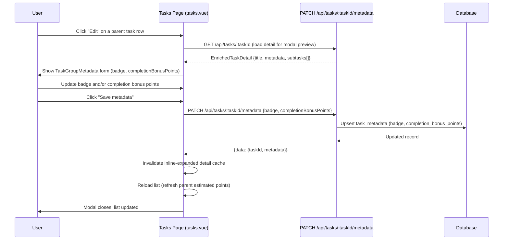
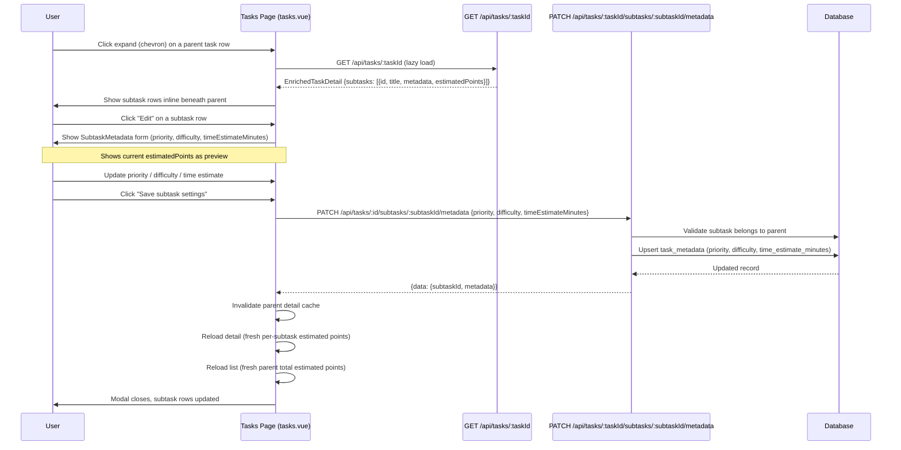

# Task Metadata Settings Flow — Diagram

Source file for task and subtask metadata editing flows.

## Context

Parent Todoist tasks are **collapsible groups** in the UI. Subtasks are the only scoring/actionable items. The two modals have separate endpoints and accept different fields.

---

## Parent Task Settings Modal Flow

---

## Subtask Settings Modal Flow

---

## Field Reference

| Field | Scope | Endpoint | Type |
|-------|-------|----------|------|
| `badge` | Parent task | PATCH `.../metadata` | `string \| null`, max 64 chars |
| `completionBonusPoints` | Parent task | PATCH `.../metadata` | non-negative integer |
| `priority` | Subtask | PATCH `.../subtasks/:id/metadata` | `"low" \| "medium" \| "high"` |
| `difficulty` | Subtask | PATCH `.../subtasks/:id/metadata` | integer 1–10 |
| `timeEstimateMinutes` | Subtask | PATCH `.../subtasks/:id/metadata` | positive integer or null |
