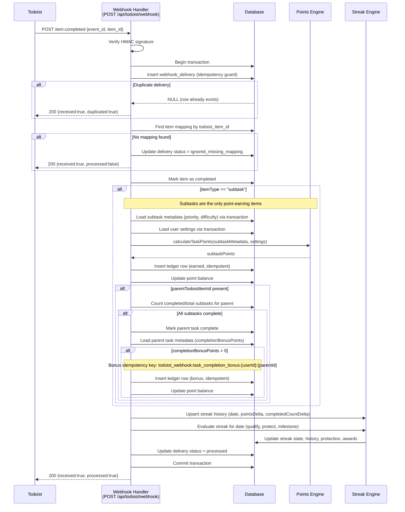

# Webhook Processing — Sequence Diagram

Source for `Webhook_Processing-sequence.png`.

## Mermaid

## Notes

- Parent task `item:completed` events are still synced (marking the task complete locally) but do **not** award points.
- Only `itemType === 'subtask'` entries earn points and count toward streak completion rules.
- The completion bonus is a fixed integer per parent task (`completionBonusPoints`), not a percentage of subtask totals.
- All DB operations within the handler run in a single transaction with a 1-connection pool (postgres.js `max: 1`). Nested queries **must** reuse the transaction object to avoid deadlocks.
